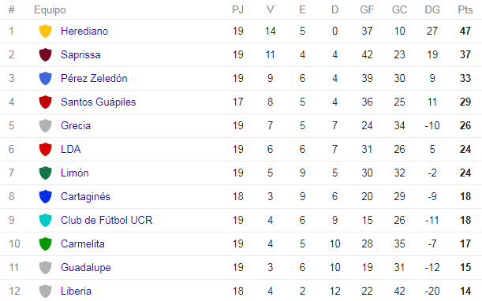

# *Tabla de posiciones*
El presente programa realizará una tabla de posiciones de un torneo de fútbol
basado en el formato del torneo de **Fútbol de Primera División**. En este torneo, los equipos se enfrentan todos contra todos en dos partidos, uno de ida y otro de vuelta. 
	
Cuando un equipo gana, se le suman 3 puntos; cuando empata, se le suma 1 y cuando pierde, no se le suma ninguno.
En caso de que dos equipos tengan la misma cantidad de puntos, el que tenga mayor gol diferencia (cantidad de goles realizados, menos la cantidad de goles recibidos), será el que esté arriba del otro. Si el gol diferencia es igual, se definirá por el que haya metido mayor cantidad de goles.

Para realizar la tabla, el usuario seguirá los siguientes pasos:

1. Se definirá la cantidad de equipos que competirán en el torneo.
2. Se nombrará a cada uno de los equipos
3. Se ingresará los resultados de cada jornada entre cada equipo.

Una vez definidos los datos, el programa realizará los cálculos correspondientes y mostrará una tabla 
similar a la mostrada a continuación:

### Limitaciones

El programa mostrará únicamente la tabla al final del torneo, no se mostrarán las tablas cuando hay
jornadas pendientes. Razón por la cual, el usuario debe ingresar al programa todos los resultados de la jornada. 
