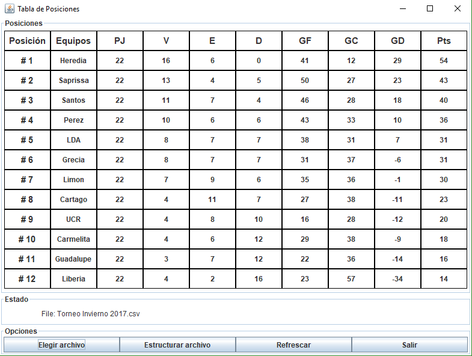

# *Tabla de posiciones*
El presente programa realizará una tabla de posiciones de un torneo de fútbol
basado en el formato del torneo de **Fútbol de Primera División**. En este torneo, los equipos se enfrentan todos contra todos en dos partidos, uno de ida y otro de vuelta. 
	
Cuando un equipo gana, se le suman 3 puntos; cuando empata, se le suma 1 y cuando pierde, no se le suma ninguno.
En caso de que dos equipos tengan la misma cantidad de puntos, el que tenga mayor gol diferencia (cantidad de goles realizados, menos la cantidad de goles recibidos), será el que esté arriba del otro. Si el gol diferencia es igual, se definirá por el que haya metido mayor cantidad de goles.

Para realizar la tabla, el usuario seguirá los siguientes pasos:

1. El usuario creará un archivo con formato .csv : _archivo con valores  separados por comas **(.csv)**_
2. El usuario escribirá los nombres de cada equipo separados por comas en la primer línea del archivo
3. En las siguientes líneas los datos se ingresarán con el formato: **número de partido, nombre del equipo de casa, goles de casa, nombre del equipo de visita, goles de visita**

Para evitar errores, el programa tiene un botón que estructura el archivo creado, en el que se preguntará la cantidad de equipos y sus nombres. Lo que tendrá que editar el usuario serán los campos escritos como HOME_GOALS y VISIT_GOALS que corresponden a los goles del equipo en casa y visita de un partido

Para que los datos sean leídos, se elegirá el archivo con el formato mencionado anteriormente. Como se muestra en la siguiente imagen:

Una vez definidos los datos, el programa realizará los cálculos correspondientes y mostrará una tabla 
como la siguiente:

### Limitaciones

El programa mostrará únicamente la tabla al final del torneo, no se mostrarán las tablas cuando hay
jornadas pendientes. Sin embargo, si no se escriben algunos partidos mostrará los resultados con los partidos que se hayan jugado.
